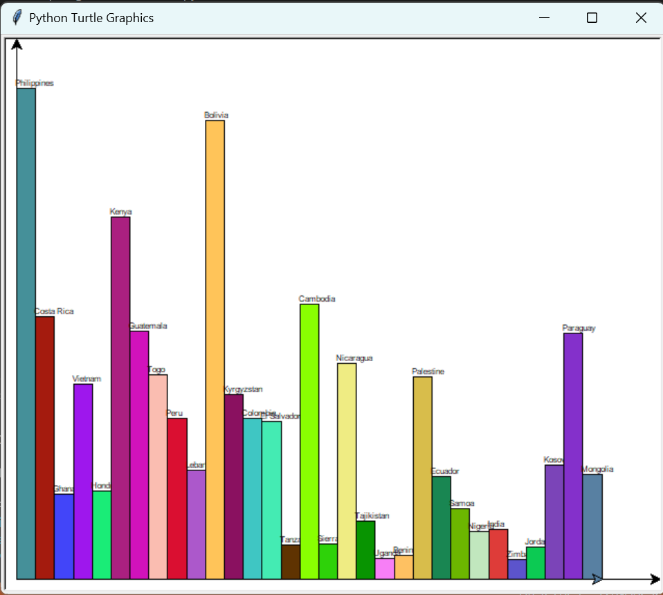
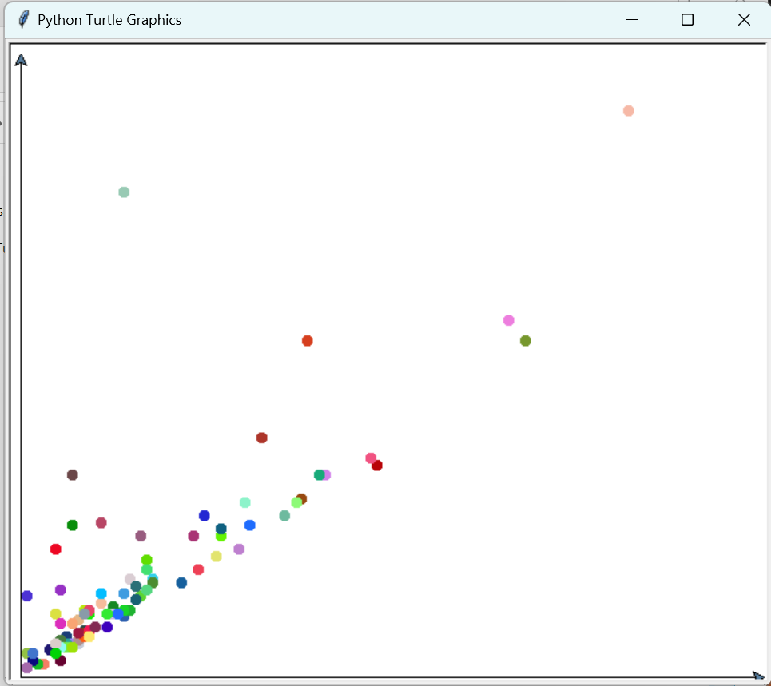
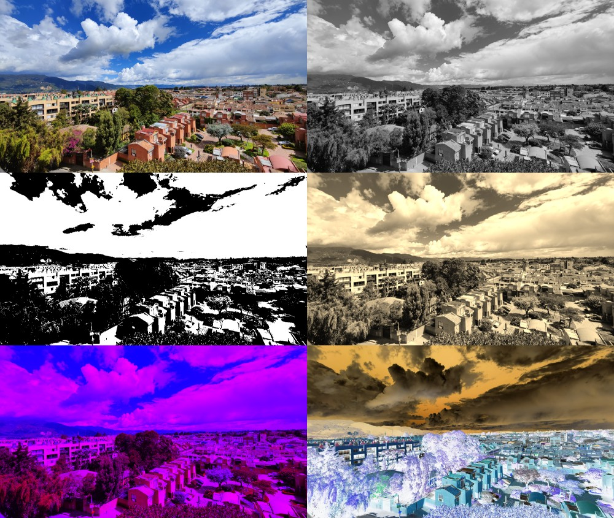

Some projects using Python.

#  [Found faces and text in zip files of images](https://github.com/scastrodri/Python_projects/tree/main/Faces_and_text_%20in_zip)
* Take a zip file of scanned images. Detect faces and text to find a specific word in every one of the images in the zip file.
* Print a legend that shows up the amount found of the specific word.
* With the faces detected create a contact sheet to show every one of them.
## A sample image

## Faces found in the sample image

# [Graphing data with the Turtle module](https://github.com/scastrodri/Python_projects/tree/main/Graphic_Turtle)
* There are many tools to graph data, but let's 'code' our own graphs from scratch using the turtle module.
* The data used is part of [Kiva](http://kiva.org/) that is an international nonprofit, founded in 2005 and based in San Francisco, with a mission to connect people 
through lending to alleviate poverty.
* The first one will be a bar chart that shows the total amount of loans for country.
* The second one is a scatter plot that prints the loan amount vs the total number of lenders.
* The last one is a histogram (using the bar chart) that is used to display 10 differents 'buckets' that are 'categories' from the loan amount.
## Bar chart

## scatter plot

# [Image Processing](https://github.com/scastrodri/Python_projects/tree/main/Image_Processing)
Much of the filters here exists are built-in functions that use numpy arrays, but in this case will be use the putpixel method, although it's a little bit slow, it's very easy and intuitive to use.
* Some basic filters as grayscale, black and white, sepia tone, neon filter, negative filter.
* A little bit of rotating, scaling and blending.
* Image Kernel for cleaning up noise (Replace every pixel with the median pixel value of the 8 pixels around it).
## All filters

## Kernel for cleaning up noise

# [Substitution Cipher](https://github.com/scastrodri/Python_projects/tree/main/Substitution_Cipher)
* A script that will encrypt the string referenced by the variable plaintext using the Caesar cipher with a shift of 13.
* A script that will encrypt the plaintext using a key.
* A script that will decrypt the ciphertext using a key.
* A scrypt that asks the user to enter a key (scrambled alphabet) and a message to encrypt or decrypt.

# [Create and 'guess' passwords](https://github.com/scastrodri/Python_projects/tree/main/Password)
* Creates an 8-letter password by combining characters from three strings (letters, CAPS, numbers).
* Creates a four-word password by combining words from three lists (nouns, verbs, and adjectives).
* Have at least one capital letter and a number in your password.
* How many guesses would it take to guess a 4 letters password? - If you change this to a 5-letter password will increase the amount of time due to the calculations.
